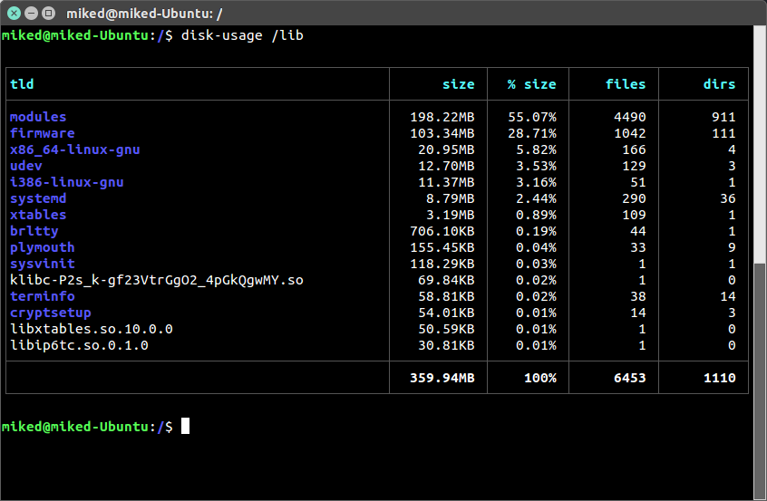
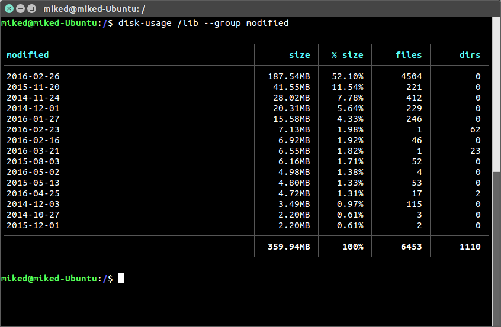
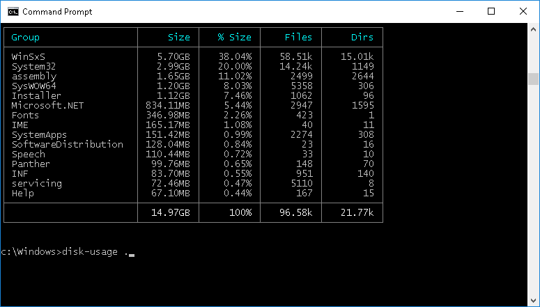

# Command line disk usage analyser
`disk-usage` is a command line disk analyser for `*nix` and `Windows` operating systems. It is similar to [WinDirStat](https://windirstat.info/) for Windows but for the command line :)



## Installation
```
$ npm install -g disk-usage
```

## Usage
```
Synopsis

  $ disk-usage [--sort size] [--group group] path
  $ dusk-usage --help

Options

  -g, --group string   Which field the results grouped by          
  -s, --sort string    Which field the results should be sorted by 
  -c, --count number   Number of results to display                
  -p, --path string    System path to start scanning               
  -r, --reverse        Reverse the results                         
  -h, --help           Display this help page     
```

## Examples
Files in the current directory grouped by top level folder
```
$ disk-usage .
```

Files in your `Documents` folder and grouped by top level folder
```bash
$ disk-usage ~/Documents
```

Files in your `Documents` folder and group by the last modified date
```bash
$ disk-usage ~/Documents --group modified
```

Files in your `Documents` folder sorted by the number of files
```bash
$ disk-usage ~/Documents --sort files
```

Group results by modified date
```bash
$ disk-usage /lib --group modified
```



## Also works on Windows



## Using the lib

As well as using disk-usage as a console application you can also use the internal library in your node applications:

```bash
$ npm install --save disk-usage
```

```javascript
const scanner = require('disk-usage')

const args = {
  path: '.',
  group: 'tld'
  sort: 'size',
  onError: (err) => {
    // disk access / permission error
  },
  onProgress (currentPath, currentStats) => {
    // called for each top level directory
  }
}

scanner
  .scan(args)
  .then((stats) => {
    // scan complete!
    console.log(stats)
  })

```